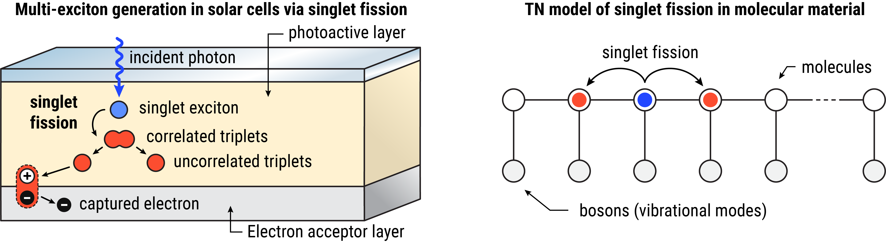

## Multi-exciton generation in molecular semiconductors via singlet fission

In organic solar cells (OSCs), incident photons are absorbed by a photoactive material to form excited electronic states, known as excitons. Excitons are then transported in the material until they reach an electron acceptor, where they undergo charge separation, producing a photocurrent. However, the short nanosecond lifetime of excitons limits the efficiency of OSCs. 

Singlet fission is an electronic processes that is now being explored as a way to improve the efficiency of organic solar cells. In singlet fission, a photo-generated  exciton with spin 0 (known as *singlet*) splits into two excitons with spin 1 (known as *triplets*) in a energy-conserving and spin-conserving transition. This process can improve OSCs efficiency by producing two excitons per absorbed photon, and by increasing the probability for the excitons to reach an electron acceptor, since triplets have a microsecond lifetime.

In this project we will implement a numerical model to study singlet fission in extended solids, which remains a challenge in the field. In particular, we will consider a 1D lattice of molecules and using tensor networks (TNs) to solve a many-body model of singlet fission. After comparing the TNs results with known solutions, we will scale up the model to study how singlet fission scales with the number $N$ of molecules. Finally, we will study the effect of disorder and of the vibrational modes of the molecular lattice.

**Scientific mentor:** Francesco Campaioli\
**Code mentor:** Alice Pagano

### Tasks

- Following the notes on singlet fission, use [qtealeaves](https://pypi.org/project/qtealeaves/) to implement the singlet fission Hamiltonian for 1D rings with $N$ sites (nearest-neighbour couplings and periodic boundary conditions). Ignore the vibrational modes so that each site represents an exciton site. 

- Study the unitary dynamics of an initial singlet exciton state. Consider the parameters of the *resonant triplet-pair solution* with singlet exciton energy $\varepsilon_S = 1$ (see notes) and initialise the system in the ground state of the singlet exciton Hamiltonian with $n_0 = 1$ singlet in the medium. Propagate this initial state via a quench monitoring the total number of singlets and triplets, and compare the results with the solution provided in the jupyter notebook for $N = 4$. 

    - How does the solution change with the bond dimension (`max_bond_dimension`)?
    - Does the dynamics change with the number $N$ of sites?

- Implement the function to evaluate singlet fission efficiency over a time interval (see notes) and study the efficiency of singlet fission (i.e., how likely 2$n$ triplets are formed per $n$ initial singlet excitons) as a function of the initial number of singlet excitons $n_0\in(1,N)$.

- Generalise the model by allowing disorder (see code snippet for help) both in the local terms and in the two-body interactions. Study the dynamics of the system with disorder in the triplet hopping coupling $J_T$ and in the triplet-triplet interaction $\chi$, by running multiple trajectories, each with a different realisation of disorder. Only consider one initial singlet in the medium ($n_0=1$). Does disorder improve or worsen singlet fission efficiency?

- Extend the model by adding one vibrational mode (phonon) per site (see notes). Embed the excitons and the phonon (which can be modelled as a boson) within the same site (see code snippet for help) and limit the size of the phonon to $n_{max} = 3$ (`fock_space_nmax = 3`). Assume that the phonons relax via the local Lindblad operators $a$, with relaxation rate $\gamma_- = 0.1 \varepsilon_S$. Couple the phonon to the excitons only via singlet-phonon interactions with coupling strength $g_S$. Study the dynamics of the exciton-phonon system as a function of $g_S$ for $N=4$ ignoring disorder. Use the open system mode for quantum trajectories without jumps (`oqs_mode = 2`).

### Material

- Notes on the theoretical formulation of singlet fission in many-body systems.
- A jupyter notebook with the QuTiP implementation of the *resonant triplet-pair solution*, which can be used to compare the TTN results with an exact solution.
- Code snippet to generate different random local and two-body terms over multiplet trajectories.
- Code snippet to implement an exciton-boson site embedding.