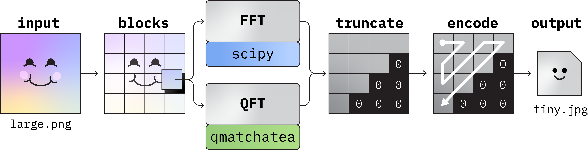

## Data compression with quantum Fourier transform

The Fourier Transform is the cornerstone of frequency analysis and the fundamental step in many signal processing algorithms, from noise cancelling to audio and image compression. By working in the Fourier space, we can optimally approximate an input signal, for example, by cutting the frequencies that are not visible/audible by a human. This is the basic principle behind lossy image (JPEG) and audio (MPEG) compression, which gave us the ubiquitous *jpg* and *mp3* codecs that we are so familiar with.

The best available (classical) implementation of the Fourier transform is the *Fast Fourier Transform* (FFT) algorithm. Despite being highly optimized, it scales as $O(N\log_2N)$, where $N$ is the number of entries of the vector we are considering. Without loss of generality, we constraint ourselves in the case $N=2^n$, such that the FFT scaling can be expressed as $O(2^nn)$. Interestingly, the quantum version of the Fourier transform (QFT), presents an exponential speedup in the scaling $O(n^2)$, where we can now identify $n$ with the number of qubits. For this reason, the QFT is at the basis of many quantum algorithms, such as the celebrated Shor's algorithm, over classical methods for the notoriously complex problem of number factorisation.

In this project we will tackle the compression of images using the standard JPEG compression codec. First, we will use the classical FFT algorithm and then, we will implement the QFT algorithm using matrix product operators on *qmatchatea*.
While a speedup is not guaranteed when running the QFT on a classical machine, an advantage is achievable when processing sufficiently large signals, or by running the algorithm on a real quantum device.

**Scientific Mentors:** Francesco Campaioli, Marco Ballarin\
**Code Mentor:** Marco Ballarin

### Tasks

- Implement the JPEG image compression algorithm using the FFT.
- Write the quantum circuit, implement the QFT algorithm in qiskit.
- Modify the application of the FFT in the JPEG algorithm with a QFT.
- Apply the algorithm to different images and different scales. Compare the computational
  time and the scaling for the classical FFT and the QFT.
- [OPTIONAL] Repeat the analysis for the approximate QFT, studying the dependency of the results in the
  approximation factor.

### Materials

[1] The latest version (1.1.x) of quantum matcha TEA can be installed with `pip install qmatchatea` or directly downloaded from
    the [gitlab repository](https://baltig.infn.it/quantum_matcha_tea/py_api_quantum_matcha_tea).

[2] Qiskit tutorial for the [QFT](https://medium.com/@_monitsharma/learn-quantum-computing-with-qiskit-quantum-fourier-transform-e27176c8f378).

[3] You can find in the folder an example [image to compress and its compressed version](image_compression.png)

[4] We prepared a [python script](image_handling.py) to read/write an image.

[5] We prepared a [qmatchatea example](qmatchatea_example.py) to show how to run a quantum circuit using qmatchatea
    and to retrieve the resulting state, both in tensor network and statevector form.

[6] We provided [data](./data/) of raw lossless images that can be used to test the compression method. The images are taken from the following [dataset](https://www.kaggle.com/datasets/saeedehkamjoo/standard-test-images).
